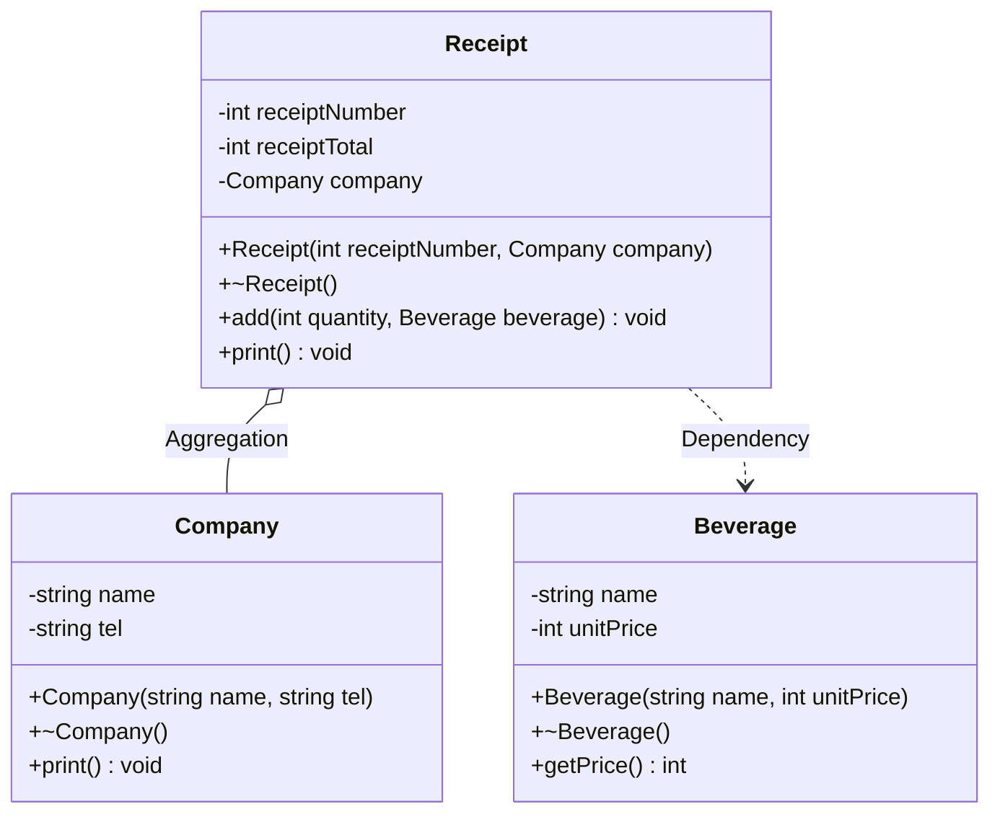

```mermaid
classDiagram
    class Beverage {
        -string name
        -int unitPrice
        +Beverage(string name, int unitPrice)
        +~Beverage()
        +getPrice() int
    }

    class Company {
        -string name
        -string tel
        +Company(string name, string tel)
        +~Company()
        +print() void
    }

    class Receipt {
        -int receiptNumber
        -int receiptTotal
        -Company company
        +Receipt(int receiptNumber, Company company)
        +~Receipt()
        +add(int quantity, Beverage beverage) void
        +print() void
    }

    %% Relationship Definitions
    Receipt o-- Company : Aggregation
    Receipt ..> Beverage : Dependency
```